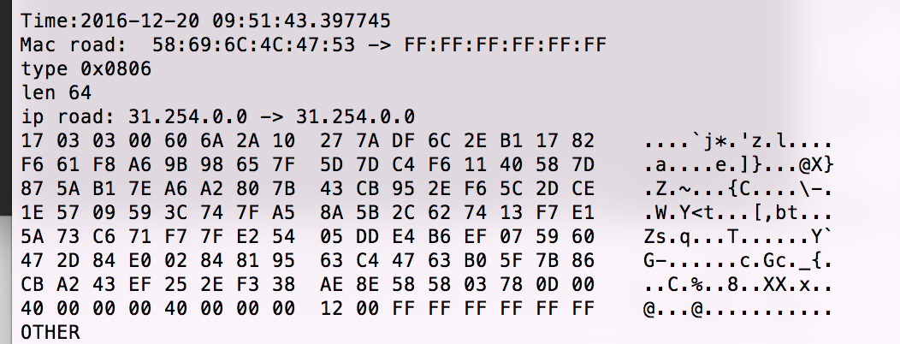

# WireTiger 
## A network monitoring application written in C using libpcap library.

## how to build
> - 1 make clean
> - 2 make
> - 3 sudo chmod 777 /dev/bpf*(for mac user, to get the power of device)
> - 4 ./wiretiger 

## specification
wiretiger [-d device] [-f file] [-e expression]

> -d  Listen on network device (e.g., en0). If not specified, wiretiger 
    should select a default device to listen on. 

> -f  Read packets from <file> (tcpdump format). 

> -e  Keep only packets that contain <string> in their payload.

##running show

